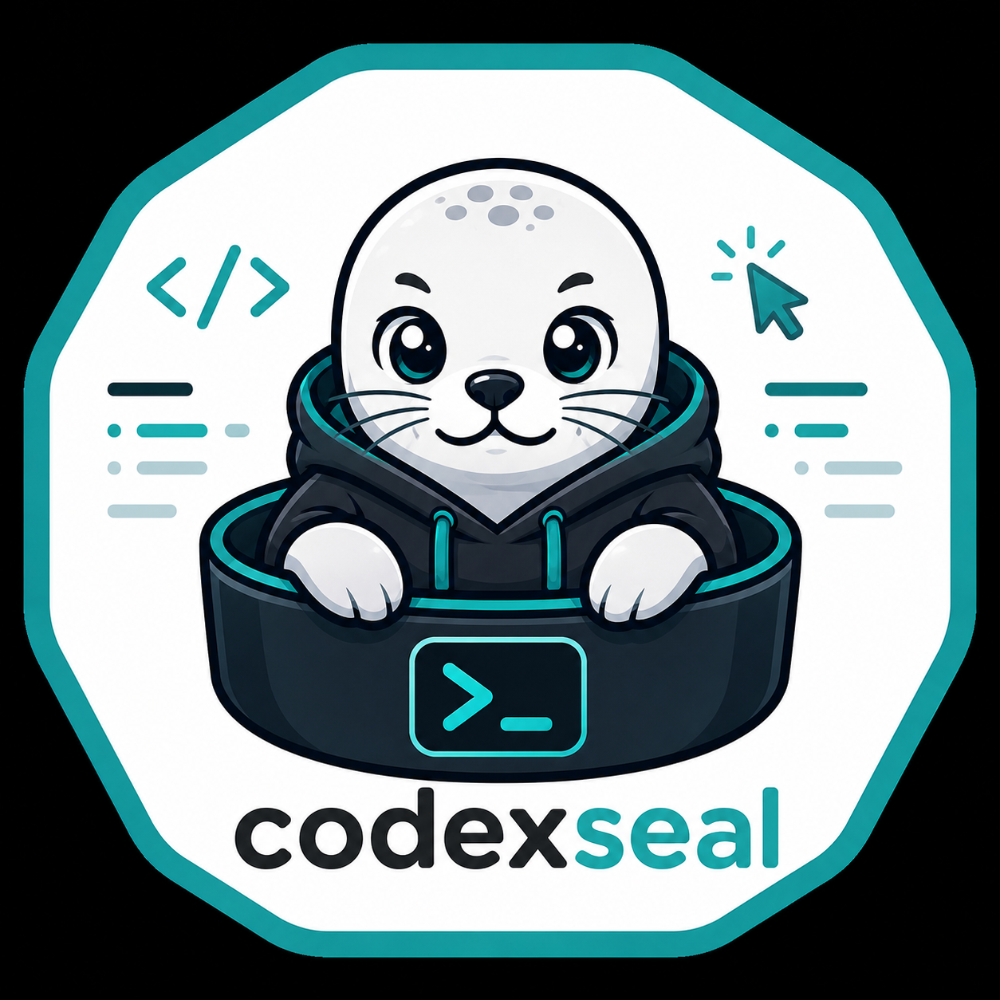

<div align="center">
  

  # CodingSeal - Codex in a Podman Container

  *Give Codex full tool access inside a rootless Podman container while keeping
  your host filesystem limited to the project directories you explicitly mount.*
</div>

---

## What You Get

- Codex CLI installed in an isolated Ubuntu container
- Full Codex permissions inside the container via `--yolo`
- Persistent Codex login and config in `~/.codingseal/codex-auth`
- Repeatable project mounts with `-p`
- VS Code Remote-SSH support
- Built-in MCP servers for Context7 and Sequential Thinking
- Optional GitHub MCP server when `GITHUB_PERSONAL_ACCESS_TOKEN` is set
- Optional NVIDIA or AMD GPU passthrough

```
HOST MACHINE
  PODMAN CONTAINER
    codex -> mounted project directories only
    sshd  -> optional VS Code Remote-SSH access on localhost:2222

host dir: ~/.codingseal/codex-auth -> /home/coder/.codex
```

## Prerequisites

| Requirement | How to check |
|---|---|
| Podman >= 4.3 | `podman --version` |
| OpenAI or ChatGPT account | Codex supports ChatGPT login and API-key login |
| SSH key pair | `ls ~/.ssh/id_*.pub` |
| VS Code | Optional, with the Remote - SSH extension |
| NVIDIA or AMD drivers | Optional, only for GPU passthrough |

## Quick Start

```bash
git clone https://github.com/TorbenGl/codingseal.git
cd codingseal
cp .env.example .env
# Edit .env if you want SSH mode or optional MCP tokens.

podman build -t coding-seal:latest .

scripts/run.sh --auth
scripts/run.sh -p ~/projects/myproject
```

Pass an initial prompt after `--`:

```bash
scripts/run.sh -p ~/projects/myproject -- "fix the failing tests"
```

## Security Model

CodingSeal treats the container as the security boundary. Codex runs with full
permissions inside the container, but the only host paths it can access are the
directories you pass with `-p` and the Codex auth/config directory.

Codex can:

- Read and write mounted project directories
- Run commands inside the container
- Use outbound network access from the container
- Persist auth and Codex state in `~/.codingseal/codex-auth`

Codex cannot:

- Read unmounted host files
- Modify host files outside mounted project paths
- Access host processes
- Persist container-layer changes after the container exits

## Authentication

Run this once:

```bash
scripts/run.sh --auth
```

The command runs `codex login --device-auth` inside the container. Complete the
device login flow in your browser. Codex state is stored in:

```bash
~/.codingseal/codex-auth
```

Override the location with `CODEX_AUTH_DIR`.

To remove saved Codex state:

```bash
rm -rf ~/.codingseal/codex-auth
```

## Project Mounts

Pass `-p` once per directory:

```bash
scripts/run.sh \
  -p ~/projects/myapp \
  -p ~/projects/shared-lib \
  -p ~/datasets/training-data
```

The first `-p` path becomes Codex's working directory. All project paths are
mounted at the same absolute path inside the container, so Git remotes, symlinks,
and cross-repo imports behave as they do on the host.

For convenience, projects are also mounted under:

```bash
/home/coder/project              # first -p path
/home/coder/projects/<dirname>   # every -p path
```

## Local Terminal Mode

```bash
scripts/run.sh -p ~/projects/myproject
```

This starts an interactive Codex TUI with:

```bash
codex --yolo
```

The `--yolo` flag is intentional because Podman is already providing the outer
sandbox.

To open a shell instead:

```bash
podman run -it --rm \
  --userns=keep-id \
  --volume ~/.codingseal/codex-auth:/home/coder/.codex:Z \
  --volume ~/projects/myproject:~/projects/myproject:Z \
  localhost/coding-seal:latest \
  bash
```

## VS Code Remote-SSH

Start the container in SSH mode:

```bash
set -a && source .env && set +a
scripts/run.sh --ssh -p ~/projects/myproject
```

Add an SSH host:

```sshconfig
Host codex-container
    HostName 127.0.0.1
    Port 2222
    User coder
    IdentityFile ~/.ssh/id_ed25519
    StrictHostKeyChecking no
    UserKnownHostsFile /dev/null
```

Connect with VS Code's Remote-SSH extension, then run:

```bash
cd /home/coder/project
codex --yolo
```

Inside the remote VS Code window, terminals, extensions, language servers, and
Codex all run in the container.

Stop the container with:

```bash
podman stop coding-seal
```

## Access From Another Machine

The SSH port binds to `127.0.0.1` on the host. From another machine, tunnel
through the host:

```bash
ssh -N -L 2222:localhost:2222 youruser@your-workstation
ssh -p 2222 -i ~/.ssh/id_ed25519 coder@localhost
```

## MCP Servers

`scripts/run.sh` seeds MCP configuration into `~/.codingseal/codex-auth/config.toml`.

| Server | Enabled | Auth |
|---|---|---|
| context7 | Always | Optional `CONTEXT7_API_KEY` |
| sequential-thinking | Always | None |
| github | When `GITHUB_PERSONAL_ACCESS_TOKEN` is set | Bearer token |

Verify inside Codex with `/mcp`, or from a shell with:

```bash
codex mcp list
```

## GPU Support

NVIDIA, preferred CDI path:

```bash
scripts/run.sh --gpu-nvidia -p ~/projects/ml-project
```

This requires NVIDIA's CDI spec to be installed on the host. With recent NVIDIA
container tooling, generate it with:

```bash
sudo nvidia-ctk cdi generate --output=/etc/cdi/nvidia.yaml
```

Then verify from inside the container:

```bash
nvidia-smi
```

If `nvidia-smi` is missing, the GPU device may be visible but NVIDIA's user-space
tools and driver libraries were not injected. Raw device passthrough alone does
not install `nvidia-smi` in the image.

Legacy raw device passthrough is still available:

```bash
scripts/run.sh --gpu-nvidia-devices -p ~/projects/ml-project
```

AMD:

```bash
scripts/run.sh --gpu-amd -p ~/projects/ml-project
```

No GPU is the default.

## Updating

Rebuild the image:

```bash
podman build --pull=newer -t coding-seal:latest .
```

The Codex auth/config directory is bind-mounted from the host, so rebuilding the
image does not remove your login.

## Troubleshooting

| Symptom | Fix |
|---|---|
| `codex` asks to authenticate every run | Run `scripts/run.sh --auth` and verify `~/.codingseal/codex-auth` is populated |
| `codex: command not found` | Rebuild the image |
| SSH mode fails immediately | Set `SSH_PUBLIC_KEY`, usually via `.env` |
| VS Code terminal is on the host | Confirm the window title shows `[SSH: codex-container]` |
| MCP server is missing | Re-run `scripts/run.sh`; it re-seeds `config.toml` |
| Project files are not visible | Pass the directory with `-p` |

## Repository Layout

```
.
├── Containerfile
├── README.md
├── codingseal.png
├── scripts/
│   └── run.sh
└── config/
    ├── codex-config.toml
    └── sshd_config
```
